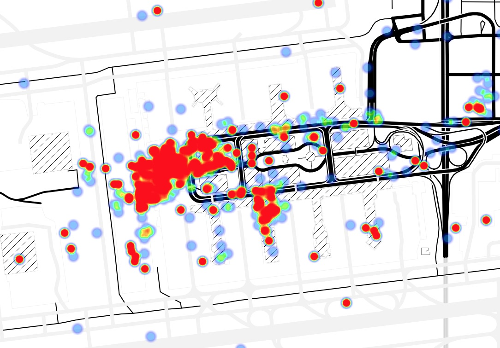

# Locbook

Locbook is a minimalist HTTP server for the [Owntracks](https://github.com/owntracks) mobile application, written in Python 3. It is intended to run on your own remote machine behind a modern web server like [Caddy](https://github.com/mholt/caddy).

*I spend way too much time at LAX...*

## Why?

Tracking the location of one's mobile device can be extremely useful for many different applications. Unfortunately, until recently, it was very difficult to host your own location tracking system independent of large companies like Google who sell such data to advertisers. With the [Owntracks](https://github.com/owntracks) project, self-hosted location tracking has become feasible.

Locbook aims to provide the smallest possible implementation of a robust, personal Owntracks server that is still usable on a daily basis, mainly as a personal logbook. It is meant as a lightweight alternative to [Owntracks Recorder](https://github.com/owntracks/recorder).

## Features and limitations

- Minimal dependencies
- Easy integration with [Caddy](https://github.com/mholt/caddy)
- Import function for existing Google location data
- Export to GeoJSON
- Minimalist heat-map visualization based on [Leaflet](https://github.com/Leaflet/Leaflet)
- Single-user only
- Uses HTTP, not MQTT

## Installation

On your remote machine, install the necessary dependencies:
~~~~~~~~
pip install ijson geojson
~~~~~~~~
Then, simply clone this repository and run `python3 locbook.py`. This runs Locbook and creates an internal `history.pickle` file which contains all data sent by Owntracks. To generate a human-readable backup of this data, use the `export_geojson` option. 

Most likely, you will want to run Locbook in the background and independent of your SSH session on your remote machine. This can be achieved by running:
~~~~~~~~
nohup python3 locbook.py &
~~~~~~~~

## Options

There are only four options to run Locbook, to view them use `--help`.
- `--import_google`: Supply a path to a Google location history JSON file created with [Google Takeout](https://takeout.google.com/settings/takeout). Quits after import.
- `--export_geojson`: Export existing history to supplied file. Quits after export.
- `--logfile`: Log events to supplied file instead of the terminal.
- `--port`: Listen on specified port, defaults to port 9001.

## Integration with web server

Simply set up a reverse proxy and point the web server to the Locbook directory. Don't forget to protect the directory! An example Caddyfile entry with HTTPS enabled (for instance through [Let's Encrypt](https://letsencrypt.org)) could look like this:

~~~~~~~~
SERVER {
	basicauth / "USERNAME" "PASSWORD"
	root ~/locbook
	tls USERNAME@SERVER
	proxy /api localhost:9001
	minify
}
~~~~~~~~

Now just visit SERVER and enter USERNAME and PASSWORD to see the visualization. The visualization is based on [Leaflet](https://github.com/Leaflet/Leaflet) and can be completely customized by changing the [index.html](index.html) file.

## Example iPhone Owntracks configuration file

[This](iphone_example.otrc) is an example configuration for the [Owntracks iPhone app](https://github.com/owntracks/ios). Replace `SERVER`, `USERNAME`, and `PASSWORD` with your own values, then send to an email address accessible by your iPhone and import settings into Owntracks. Android configuration files might need to include some different parameters, see the [Owntracks JSON documentation](http://owntracks.org/booklet/tech/json/).